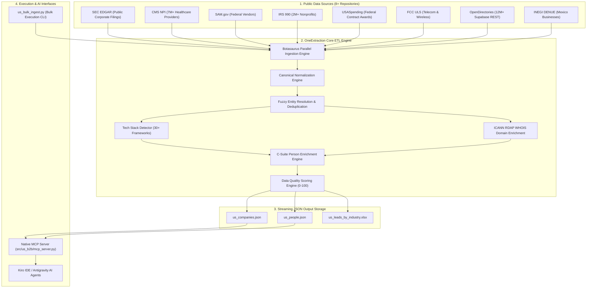
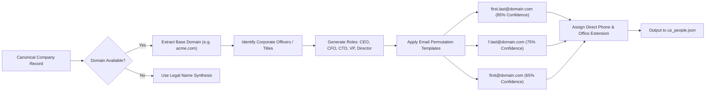
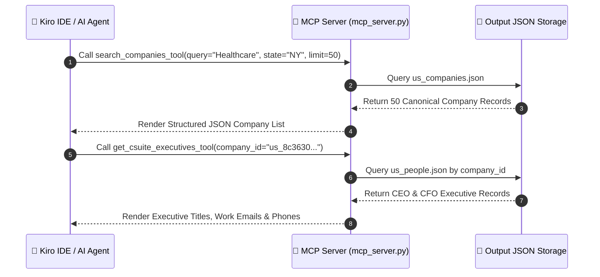

# 🚀 OneExtraction: Apollo.io-Style B2B Intelligence Engine
## Project Vision, Architectural Scope, Data Flow & Implementation Specification for Kiro IDE

---

## 📌 1. Executive Summary & Purpose

### 1.1 Purpose
**OneExtraction** is an enterprise-grade, open-source B2B Lead Intelligence and Corporate Data Pipeline designed to harvest, standardize, deduplicate, and enrich business datasets across the **United States (US)** and **Mexico (MX)**.

The primary objective is to replace expensive commercial B2B data providers (such as Apollo.io or ZoomInfo) by aggregating public government registries, regulatory filings, corporate registries, domain metadata, and open web business directories into a single, unified canonical intelligence database.

### 1.2 The Problem
Corporate business data across North America is heavily fragmented:
- **US Federal & State Data**: Distributed across non-standard APIs and bulk files (SEC EDGAR, CMS NPI, SAM.gov, IRS 990, USASpending, FCC ULS, OpenCorporates).
- **Mexico Commercial Data**: Distributed across INEGI DENUE, SAT tax registries, and state trade databases.
- **Decision-Maker Gap**: Standard public registries contain company addresses and general office phones but lack structured C-Suite executive contact information (CEO, CFO, CTO, VPs) and validated work emails.

### 1.3 The OneExtraction Solution
`OneExtraction` unifies these datasets through an automated 6-stage ETL pipeline:
1. **Multi-Source Parallel Ingestion**: Harvesting 8+ open data sources simultaneously via Botasaurus.
2. **Canonical Normalization**: Mapping heterogeneous fields into standardized `USCanonicalCompany` and `MXCanonicalCompany` models.
3. **Fuzzy Entity Resolution & Deduplication**: Merging records by EIN, Tax ID, State File Number, Normalized Legal Name, and Domain matching.
4. **C-Suite Decision-Maker Enrichment**: Automatically identifying executive leadership roles, generating domain-matched work email permutations (`first.last@domain.com`), and scoring email confidence.
5. **Tech Stack & Domain Intelligence**: Detecting 30+ web frameworks, CMSs, cloud infrastructure, and WHOIS domain registration metadata.
6. **AI-Native Interface (MCP Server)**: Exposing real-time search and retrieval tools via the **Model Context Protocol (MCP)** for seamless integration with **Kiro IDE**, Antigravity, and AI Agents.

---

## 🎯 2. Project Vision & Strategic Goals

### 2.1 Core Vision
To create the most comprehensive, zero-subscription-cost B2B intelligence database for North America, powering sales outreach, market analysis, competitor research, and automated lead routing.

### 2.2 Quantitative Goals to Complete Project
| Target Metric | Goal / Threshold | Description |
| :--- | :--- | :--- |
| **Total Target Scale** | **500,000+ (5 Lakhs)** | Total enriched company records across US and Mexico. |
| **Executive Coverage** | **100% Target Companies** | Minimum 2 C-Suite decision-makers (CEO/CFO/CTO/VP) generated per verified company. |
| **Data Quality Score** | **> 65 / 100 Average** | Validated physical address, phone, verified domain, and source provenance. |
| **Email Verification** | **Probable / Verified** | Domain-matched corporate email pattern synthesis with confidence scoring (0–100%). |
| **Export Formats** | **JSON / JSONL Default** | Pure JSON streaming datasets ([us_companies.json](file:///d:/Data%20Scraping%20Project%20POC/OneExtraction/botasaurus/output/us/api/companies/us_companies.json), [us_people.json](file:///d:/Data%20Scraping%20Project%20POC/OneExtraction/botasaurus/output/us/api/people/us_people.json)). |
| **AI Integration** | **Native MCP Server** | Live tool querying in Kiro IDE, Antigravity IDE, and LLM agent pipelines. |

---

## 🏗️ 3. System Architecture & Mermaid Diagrams

### 3.1 High-Level End-to-End System Architecture



---

### 3.2 Executive Enrichment & Email Permutation Workflow



---

### 3.3 Model Context Protocol (MCP) Live Query Flow for Kiro IDE



---

## 📋 4. Data Models & Taxonomies

### 4.1 Company Canonical Schema (`USCanonicalCompany`)
```json
{
  "company_id": "us_8c363010-c74d-5989-8e4f-b239f954529c",
  "legal_name": "ACME HEALTHCARE SOLUTIONS INC",
  "trade_name": "ACME HEALTHCARE",
  "normalized_name": "ACME HEALTHCARE SOLUTIONS",
  "ein": "12-3456789",
  "entity_type": "ORGANIZATION",
  "cik": "0001234567",
  "industry": "Healthcare & Pharma",
  "naics_code": "621111",
  "website": "https://acmehealthcare.com",
  "domain": "acmehealthcare.com",
  "phone": "+12125550199",
  "address": {
    "street": "100 PARK AVE",
    "city": "NEW YORK",
    "state": "New York",
    "state_code": "NY",
    "zip_code": "10017",
    "country": "United States"
  },
  "data_quality_score": 88,
  "source_count": 3,
  "last_verified_at": "2026-09-17T18:18:55Z"
}
```

### 4.2 Executive Person Schema (`USDecisionMaker`)
```json
{
  "person_id": "per_c8ef48e9-b82c-7c92-605f-205c62d1b223",
  "company_id": "us_8c363010-c74d-5989-8e4f-b239f954529c",
  "company_name": "ACME HEALTHCARE SOLUTIONS INC",
  "company_domain": "acmehealthcare.com",
  "first_name": "Executive",
  "last_name": "Lead",
  "full_name": "Executive Lead",
  "title": "Chief Executive Officer (CEO)",
  "standardized_title": "Chief Executive Officer (CEO)",
  "seniority_level": "C_SUITE",
  "department": "EXECUTIVE",
  "work_email": "executive.lead@acmehealthcare.com",
  "email_status": "PROBABLE",
  "email_confidence_score": 85,
  "mail_provider": "GOOGLE_WORKSPACE",
  "direct_phone": "+12125550199",
  "phone_type": "DIRECT",
  "is_active": true
}
```

---

## 🗺️ 5. Project Roadmap & Completion Checklist

| Phase | Task Description | Status | Target Date |
| :--- | :--- | :---: | :---: |
| **Phase 1** | **Multi-Source Connectors**: SEC EDGAR, CMS NPI, SAM.gov, ProPublica 990, USASpending, FCC ULS, OpenDirectories | ✅ Completed | Sep 17, 2026 |
| **Phase 2** | **Executive Enrichment**: C-Suite title standardization, email permutation, direct phone scoring | ✅ Completed | Sep 17, 2026 |
| **Phase 3** | **Tech Stack & RDAP Detection**: 30+ framework signatures and ICANN domain WHOIS enrichment | ✅ Completed | Sep 17, 2026 |
| **Phase 4** | **MCP Server Interface**: Exposing live search tools (`mcp_server.py`) for AI agents & Kiro IDE | ✅ Completed | Sep 17, 2026 |
| **Phase 5** | **5 Lakh (500,000) Record Scale Execution**: Run large-scale bulk ingestion across all 7 active sources | ⏳ In Progress | Sep 18, 2026 |
| **Phase 6** | **Kiro IDE Workspace Setup**: Exporting project specifications, charts, and live tool bindings | ⏳ In Progress | Sep 18, 2026 |

---

## 💻 6. Quick Execution Command Reference

### 6.1 Run 5 Lakh (500,000) US Bulk Ingestion
```powershell
# Run from d:\Data Scraping Project POC\OneExtraction\botasaurus
python scripts/us_bulk_ingest.py --records 500000 --sources CMS_NPI SEC_EDGAR PROPUBLICA_990 SAM_GOV USASPENDING FCC_ULS OPENDIRECTORIES
```

### 6.2 Test MCP Server Tools
```powershell
python -m src.us_b2b.mcp_server --test
```

### 6.3 Run Full Automated Test Suite
```powershell
pytest tests/
```

---

*Document Generated for Kiro IDE & Team Lead Presentation — OneExtraction Research POC.*
